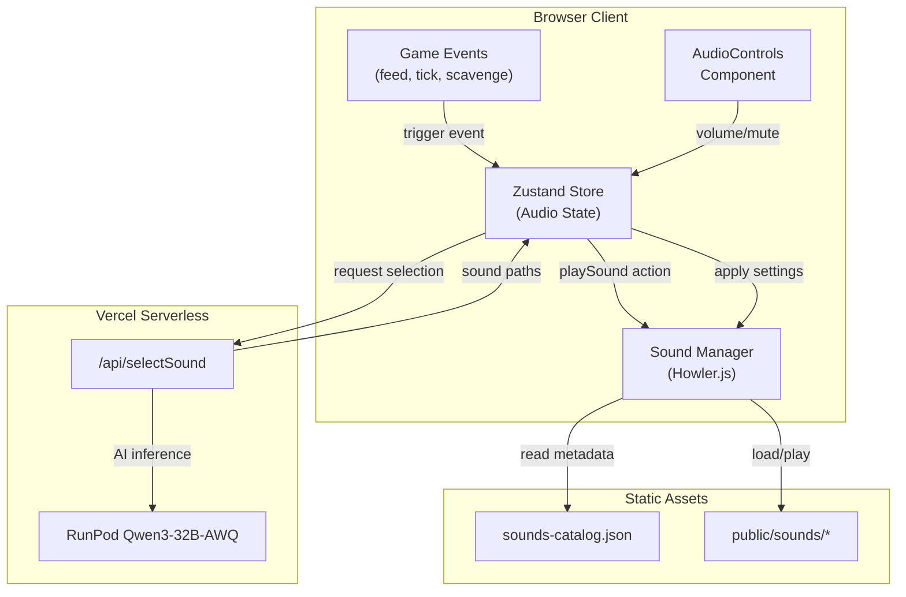

# Design Document

## Overview

The AI-powered sound system for Kiroween Game provides immersive, context-aware audio that enhances the horror atmosphere. The system consists of four main components:

1. **Sound Catalog** (`public/sounds-catalog.json`) - A structured index of all available sounds with metadata for AI selection
2. **Sound Manager** (`src/utils/soundManager.ts`) - A Howler.js wrapper handling playback, volume control, and browser autoplay policies
3. **Sound Selector API** (`/api/selectSound.ts`) - A Vercel serverless function using RunPod Qwen3-32B-AWQ for intelligent sound selection
4. **Audio State** (integrated into `src/store.ts`) - Zustand state slice for persisting audio preferences

The system integrates with existing game events (feeding, evolution, sanity changes) to automatically trigger appropriate sounds based on narrative context.

## Architecture



## Components and Interfaces

### Sound Catalog Schema

```typescript
// public/sounds-catalog.json structure
interface SoundCatalog {
  version: string;
  generatedAt: string;
  categories: {
    [category: string]: SoundEntry[];
  };
  sounds: SoundEntry[];
}

interface SoundEntry {
  id: string;                    // Unique identifier (e.g., "ambient_creepy_3")
  path: string;                  // Relative path from public/ (e.g., "sounds/Ambient/Creepy_ambience_3.wav")
  category: SoundCategory;       // Primary category
  tags: string[];                // Searchable tags for AI selection
  loop: boolean;                 // Whether sound should loop
  description: string;           // Human-readable description for AI context
  duration?: number;             // Duration in seconds (optional)
}

type SoundCategory = 
  | "ambient"      // Background atmosphere
  | "monster"      // Creature sounds (Abyssal Horror, Monsters & Ghosts)
  | "cute"         // Positive/gentle sounds
  | "stinger"      // Jump scares and transitions
  | "character"    // Player action sounds
  | "household"    // Environmental sounds
  | "liquid"       // Wet/fluid sounds
  | "ui";          // Interface feedback
```

### Sound Manager Interface

```typescript
// src/utils/soundManager.ts
interface SoundManagerConfig {
  masterVolume: number;    // 0-1
  sfxVolume: number;       // 0-1
  ambientVolume: number;   // 0-1
  isMuted: boolean;
}

interface PlayOptions {
  volume?: number;         // Override volume (0-1)
  loop?: boolean;          // Override loop setting
  fade?: number;           // Fade in duration (ms)
  onEnd?: () => void;      // Callback when sound ends
}

interface SoundManager {
  // Initialization
  initialize(catalog: SoundCatalog): Promise<void>;
  preloadSounds(soundIds: string[]): Promise<void>;
  
  // Playback
  play(soundId: string, options?: PlayOptions): string | null;  // Returns playback ID
  stop(playbackId: string): void;
  stopAll(): void;
  
  // Ambient management
  setAmbient(soundId: string, crossfadeDuration?: number): void;
  stopAmbient(): void;
  
  // Volume control
  setMasterVolume(volume: number): void;
  setSfxVolume(volume: number): void;
  setAmbientVolume(volume: number): void;
  setMuted(muted: boolean): void;
  
  // Browser autoplay
  handleUserInteraction(): void;
  isUnlocked(): boolean;
  
  // Cleanup
  dispose(): void;
}
```

### Sound Selector API Contract

```typescript
// /api/selectSound.ts
interface SoundSelectionRequest {
  eventType: "feed" | "scavenge" | "evolution" | "sanity_change" | "ambient";
  context: {
    petName: string;
    stage: PetStage;
    archetype: Archetype;
    itemType?: ItemType;        // For feeding events
    sanity: number;
    corruption: number;
    narrativeText?: string;     // Recent narrative for context
  };
}

interface SoundSelectionResponse {
  primarySound: string;         // Sound ID from catalog
  secondarySounds?: string[];   // Additional layered sounds
  ambientSound?: string;        // Background ambient to set
  volume: number;               // Recommended volume (0-1)
  cached: boolean;              // Whether result was from cache
}

// Fallback rules when AI is unavailable
interface FallbackRules {
  feed: {
    PURITY: string[];           // Gentle, cute sounds
    ROT: string[];              // Wet, disturbing sounds
  };
  evolution: {
    BABY: string[];
    TEEN: string[];
    ABOMINATION: string[];
  };
  sanity: {
    low: string[];              // Horror ambient (sanity < 30)
    normal: string[];           // Standard ambient
  };
}
```

### Audio State (Zustand Extension)

```typescript
// Added to src/store.ts
interface AudioState {
  masterVolume: number;
  sfxVolume: number;
  ambientVolume: number;
  isMuted: boolean;
  hasUserInteracted: boolean;   // Track autoplay unlock
}

interface AudioActions {
  setMasterVolume: (volume: number) => void;
  setSfxVolume: (volume: number) => void;
  setAmbientVolume: (volume: number) => void;
  toggleMute: () => void;
  setUserInteracted: () => void;
  playSound: (eventType: string, context?: object) => Promise<void>;
}
```

## Data Models

### Sound Catalog Generation

The catalog is generated by scanning `public/sounds/` and mapping directory names to categories:

| Directory | Category | Default Tags | Loop |
|-----------|----------|--------------|------|
| Abyssal Horror | monster | horror, creature, deep | false |
| Ambient | ambient | atmosphere, background | true |
| Character | character | action, player | false |
| Cute | cute | gentle, positive, happy | false |
| House & Office | household | environment, mundane | false |
| Liquids | liquid | wet, fluid, pour | false |
| Monsters & Ghosts | monster | horror, creature, ghost | false |
| Stingers and Spooky Triggers | stinger | jumpscare, transition, tension | false |

### Context-to-Sound Mapping

```typescript
// Rule-based fallback mapping
const FALLBACK_SOUNDS: FallbackRules = {
  feed: {
    PURITY: ["cute_a", "cute_b", "cute_c"],  // Gentle sounds
    ROT: ["liquid_slosh", "monster_gore_wet", "liquid_bubbles"]  // Disturbing
  },
  evolution: {
    BABY: ["cute_h", "stinger_pleasant"],
    TEEN: ["monster_growl_1", "stinger_slow"],
    ABOMINATION: ["monster_roar_4", "abyssal_descent", "stinger_dissonent"]
  },
  sanity: {
    low: ["ambient_creepy_3", "ambient_crying_moaning", "ambient_drone_doom"],
    normal: ["ambient_suburban", "ambient_rain_medium"]
  },
  stage: {
    EGG: ["ambient_suburban", "ambient_rain_medium"],           // Calm, anticipatory
    BABY: ["cute_ambient", "ambient_rain_medium"],              // Gentle
    TEEN: ["ambient_creepy_3", "ambient_mechanical_moan"],      // Unsettling
    ABOMINATION: ["ambient_drone_doom", "abyssal_descent"]      // Full horror
  }
};
```

### Critical Sounds for Preloading

The following sounds are preloaded on game start to ensure zero-latency playback:

```typescript
const CRITICAL_SOUNDS = [
  // Feeding sounds (most frequent action)
  "cute_a", "cute_b", "cute_c",           // PURITY feeding
  "liquid_slosh", "liquid_bubbles",        // ROT feeding
  
  // Evolution stingers (important moments)
  "stinger_pleasant",                      // BABY evolution
  "stinger_slow",                          // TEEN evolution
  "monster_roar_4",                        // ABOMINATION transformation
  
  // UI feedback
  "character_woosh",                       // Scavenge discovery
  "character_coin_flip",                   // UI interaction
  
  // Sanity threshold transition
  "ambient_creepy_3",                      // Low sanity ambient
  "ambient_suburban"                       // Normal ambient
];
```

### Default Volume Settings

```typescript
const DEFAULT_AUDIO_STATE: AudioState = {
  masterVolume: 0.7,    // 70% - comfortable default
  sfxVolume: 0.8,       // 80% - slightly prominent for feedback
  ambientVolume: 0.5,   // 50% - background, not overwhelming
  isMuted: false,
  hasUserInteracted: false
};
```

### Sound Selection Cache Strategy

```typescript
// In-memory cache (session-only, not persisted to localStorage)
// Rationale: Sound selections should feel fresh each session while
// maintaining consistency within a session
interface SoundCache {
  entries: Map<string, CacheEntry>;
  maxSize: 100;  // Limit memory usage
}

interface CacheEntry {
  response: SoundSelectionResponse;
  timestamp: number;
  hitCount: number;
}

// Cache key generation (deterministic)
function getCacheKey(request: SoundSelectionRequest): string {
  return JSON.stringify({
    eventType: request.eventType,
    stage: request.context.stage,
    archetype: request.context.archetype,
    itemType: request.context.itemType,
    sanityBucket: Math.floor(request.context.sanity / 10) * 10,  // Bucket by 10s
    corruptionBucket: Math.floor(request.context.corruption / 20) * 20  // Bucket by 20s
  });
}
```

### Ambient Crossfade Triggers

Ambient sounds crossfade (2 second duration) on these events:

| Trigger | From | To |
|---------|------|-----|
| Sanity drops below 30 | Normal ambient | Horror ambient |
| Sanity rises above 30 | Horror ambient | Normal ambient |
| Evolution to BABY | EGG ambient | BABY ambient |
| Evolution to TEEN | BABY ambient | TEEN ambient |
| Evolution to ABOMINATION | Any ambient | ABOMINATION ambient |
| Game start | Silence | Stage-appropriate ambient |
```


## Correctness Properties

*A property is a characteristic or behavior that should hold true across all valid executions of a system-essentially, a formal statement about what the system should do. Properties serve as the bridge between human-readable specifications and machine-verifiable correctness guarantees.*

### Property 1: Catalog Entry Completeness

*For any* sound file path in the public/sounds/ directory, the generated catalog entry SHALL contain all required fields: id, path, category, tags (non-empty array), loop (boolean), and description (non-empty string).

**Validates: Requirements 1.1**

### Property 2: Catalog Round-Trip Serialization

*For any* valid SoundCatalog object, serializing to JSON via the pretty-printer and then parsing back SHALL produce an equivalent catalog with identical entries.

**Validates: Requirements 1.4**

### Property 3: Sound Lookup Correctness

*For any* sound entry in the catalog and any of its tags, looking up by that tag SHALL return a result set that includes that sound entry.

**Validates: Requirements 1.2**

### Property 4: Volume Channel Independence

*For any* combination of master, sfx, and ambient volume values (0-1), setting one volume channel SHALL NOT affect the values of the other two channels.

**Validates: Requirements 2.5**

### Property 5: Autoplay Policy Compliance

*For any* Sound_Manager instance that has not received a user interaction event, the isUnlocked() method SHALL return false and all playback attempts SHALL be silenced.

**Validates: Requirements 2.3**

### Property 6: User Interaction Unlocks Audio

*For any* Sound_Manager instance, after handleUserInteraction() is called, isUnlocked() SHALL return true (unless user has explicitly muted).

**Validates: Requirements 2.4**

### Property 7: API Response Structure Validity

*For any* valid SoundSelectionRequest, the SoundSelectionResponse SHALL contain a non-empty primarySound string and a volume number between 0 and 1.

**Validates: Requirements 3.2**

### Property 8: Fallback Sound Mapping Correctness

*For any* feeding event with itemType PURITY, the fallback selection SHALL return sounds from the "cute" category. *For any* feeding event with itemType ROT, the fallback selection SHALL return sounds from the "liquid" or "monster" categories.

**Validates: Requirements 3.4**

### Property 9: Low Sanity Horror Sound Selection

*For any* sound selection request where sanity < 30, the selected ambientSound SHALL be from the "monster" or "ambient" category with horror-related tags.

**Validates: Requirements 3.5**

### Property 10: Audio State Persistence Round-Trip

*For any* AudioState with valid volume values (0-1) and boolean isMuted, persisting to localStorage and rehydrating SHALL produce an equivalent AudioState.

**Validates: Requirements 4.1, 4.2**

### Property 11: Volume Change Propagation

*For any* volume change action (setMasterVolume, setSfxVolume, setAmbientVolume), the Sound_Manager's corresponding volume SHALL equal the new value immediately after the action completes.

**Validates: Requirements 4.3**

### Property 12: Mute Affects All Channels

*For any* AudioState, toggling mute SHALL result in all audio channels (master, sfx, ambient) being silenced or restored simultaneously.

**Validates: Requirements 4.4**

### Property 13: Feed Triggers Sound Selection

*For any* feed action with a valid itemId, the sound selection SHALL be called with eventType "feed" and context containing the correct itemType (PURITY or ROT).

**Validates: Requirements 5.1**

### Property 14: Evolution Triggers Appropriate Sounds

*For any* evolution event to stage S, the selected sound SHALL be from the evolution sound set corresponding to stage S.

**Validates: Requirements 5.3**

### Property 15: Sanity Threshold Ambient Change

*For any* sanity value transition that crosses the 30 threshold (either direction), the ambient sound SHALL change to match the new sanity range (horror for <30, normal for >=30).

**Validates: Requirements 5.4, 5.5**

### Property 16: ARIA Labels on All Controls

*For any* interactive element in the AudioControls component (sliders, buttons), the element SHALL have a non-empty aria-label attribute.

**Validates: Requirements 6.3**

### Property 17: Slider Updates State

*For any* volume slider adjustment to value V, the corresponding Audio_State volume property SHALL equal V after the change event completes.

**Validates: Requirements 6.4**

### Property 18: Error Logging Without Crash

*For any* invalid sound ID passed to play(), the Sound_Manager SHALL call errorLogger and return null without throwing an exception.

**Validates: Requirements 7.1**

### Property 19: Deterministic Caching

*For any* two identical SoundSelectionRequests made within the same session, the responses SHALL be identical and the second request SHALL use the cached result.

**Validates: Requirements 8.1, 8.2, 8.3**

## Error Handling

### Sound Loading Errors

```typescript
// In soundManager.ts
async preloadSound(soundId: string): Promise<boolean> {
  try {
    const entry = this.catalog.sounds.find(s => s.id === soundId);
    if (!entry) {
      logWarning(`Sound not found in catalog: ${soundId}`);
      return false;
    }
    
    await new Promise((resolve, reject) => {
      const howl = new Howl({
        src: [entry.path],
        onload: resolve,
        onloaderror: (_, error) => reject(error)
      });
      this.sounds.set(soundId, howl);
    });
    return true;
  } catch (error) {
    logError(`Failed to load sound: ${soundId}`, error instanceof Error ? error : undefined);
    return false;
  }
}
```

### API Timeout Handling

```typescript
// In selectSound API
const TIMEOUT_MS = 500;

async function selectWithTimeout(request: SoundSelectionRequest): Promise<SoundSelectionResponse> {
  const controller = new AbortController();
  const timeoutId = setTimeout(() => controller.abort(), TIMEOUT_MS);
  
  try {
    const result = await callRunPodAI(request, controller.signal);
    clearTimeout(timeoutId);
    return result;
  } catch (error) {
    clearTimeout(timeoutId);
    if (error instanceof Error && error.name === 'AbortError') {
      logWarning('AI sound selection timeout, using fallback');
      return selectWithFallback(request);
    }
    throw error;
  }
}
```

### Graceful Degradation

```typescript
// In store.ts playSound action
playSound: async (eventType, context) => {
  const soundManager = getSoundManager();
  
  // If sound manager failed to initialize, silently skip
  if (!soundManager) {
    logWarning('Sound manager not available, skipping audio');
    return;
  }
  
  try {
    const selection = await selectSound(eventType, context);
    soundManager.play(selection.primarySound, { volume: selection.volume });
  } catch (error) {
    logError('Sound playback failed', error instanceof Error ? error : undefined);
    // Game continues without audio
  }
}
```

## Testing Strategy

### Dual Testing Approach

The sound system uses both unit tests and property-based tests:

1. **Unit Tests** - Verify specific examples and edge cases
2. **Property-Based Tests** - Verify universal properties using fast-check

### Property-Based Testing Framework

- **Library**: fast-check (already installed, see package.json)
- **Minimum Iterations**: 100 per property test
- **Test File Location**: Co-located with source (e.g., `src/utils/soundManager.test.ts`)

### Test Annotation Format

All property-based tests MUST be annotated with:
```typescript
// **Feature: ai-sound-system, Property {number}: {property_text}**
```

### Unit Test Coverage

| Component | Test File | Coverage Focus |
|-----------|-----------|----------------|
| Sound Catalog | `src/utils/soundCatalog.test.ts` | Schema validation, category mapping |
| Sound Manager | `src/utils/soundManager.test.ts` | Playback, volume, autoplay |
| Select Sound API | `api/selectSound.test.ts` | Request/response, timeout, fallback |
| Audio State | `src/store.test.ts` (extended) | Persistence, actions |
| AudioControls | `src/components/AudioControls.test.tsx` | Rendering, accessibility |

### Property-Based Test Coverage

| Property | Test Location | Generator Strategy |
|----------|---------------|-------------------|
| P1: Catalog Completeness | soundCatalog.test.ts | Generate random file paths |
| P2: Catalog Round-Trip | soundCatalog.test.ts | Generate random catalog objects |
| P3: Sound Lookup | soundCatalog.test.ts | Generate catalog + random tag queries |
| P4: Volume Independence | soundManager.test.ts | Generate 3 random volumes (0-1) |
| P7: API Response | selectSound.test.ts | Generate random valid requests |
| P8: Fallback Mapping | selectSound.test.ts | Generate PURITY/ROT contexts |
| P9: Low Sanity | selectSound.test.ts | Generate contexts with sanity < 30 |
| P10: State Round-Trip | store.test.ts | Generate random AudioState |
| P19: Deterministic Cache | selectSound.test.ts | Generate identical request pairs |

### Mocking Strategy

- **Howler.js**: Mock for unit tests to avoid actual audio playback
- **RunPod API**: Mock for testing timeout and fallback behavior
- **localStorage**: Use jsdom's built-in localStorage mock
- **Avoid mocking** for property tests where possible - test real logic

### Test Commands

```bash
# Run all tests
npm test

# Run specific test file
npm test src/utils/soundManager.test.ts

# Run with coverage
npm test -- --coverage

# Run property tests only (by file pattern)
npm test -- --testNamePattern="Property"
```
